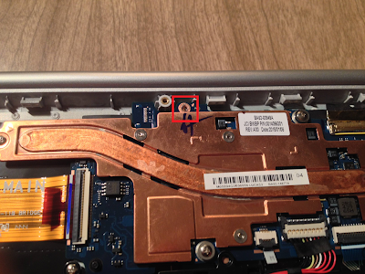
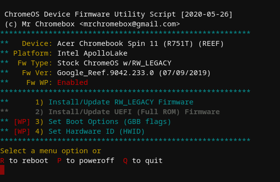

# Howto remove the Write Protect screw

1. Turn off the Chromebook.
2. Remove all the screws on the bottom of the Chromebook. (All the screws are visible - no hidden screws). The best place to start prying open is the SD Card slot.  Remove any installed card first though. Once the bottom is removed, you should see two options:    
    
    1. Some models of WINKY have a different location for the WP screw, which is much easier to access.    
    
    2. Others have to disassembly much more, Screws to remove in red, cables to undo in green.  Keep track of which screws go where.    
        
        1. The display cable has a little yellow lever thing.  Just pry it up and use it to pull backward to release it from the motherboard.    
        
        2. This little metal support bracket has a tab on it that requires you to slide it backward to release fully after taking the 3 screws out.    
        
        3. Here is the write protect screw to remove.  It is the conspicuous one with the grey wire mesh under it.    
        
        4. Here is the screw and mesh removed.    
        5. Assemble everything back together.    
3. With the motherboard all connected and screwed in, but the cover removed, turn on the computer.    

Enable Developer Mode    
Enter Recovery Mode: press/hold ESC and Refresh, then press Power for ~1s; release all 3 keys    
Press CTRL+D to switch to Developer Mode; confirm when prompted    
Press CTRL+D on Developer Mode splash screen to boot in Developer Mode    
On first boot, system will securely wipe all userdata (this takes a few minutes)    

Log in, press [Ctrl]+[Alt]+[T] to open a terminal.    
Type in "shell" and press [Enter]    

Or open the terminal window by pressing [Ctrl]+[Alt]+[F2]
Log in as chronos (not as root).    

Type in ´"cd; curl -LOk mrchromebox.tech/firmware-util.sh && sudo bash firmware-util.sh"´    
It should give the following result:    
    
If it was successful, you can put the cover back on the Chromebook.    